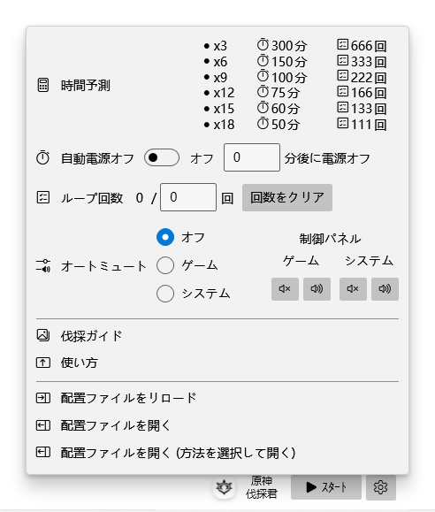
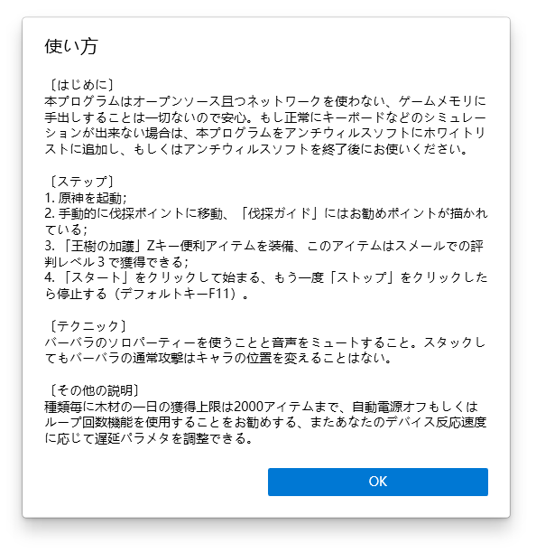

・[English](README.md) ・[中文](README.zh.md) ・[日本語](README.jp.md)

# 原神伐採君

> GenshinWoodmen

本プログラムは原神の自動伐採に用いられるツールです。スメールでの評判レベル３で獲得できる便利アイテム「王樹の加護」を利用するのが主な趣旨。

## スクショ

## 使い方

## 推薦の伐採穴場

## FAQs

1. もしセットアップがインストールできない場合は、システムにアプリストアが実装されているかどうかをご確認ください。セットアップはアプリストアに依存している (MSIX)。
2. 実行環境はnet6.0-windows10.0.18362.0。

