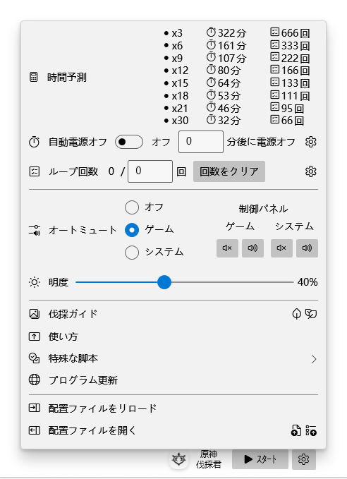

・[English](README.md) ・[中文](README.zh.md) ・[日本語](README.jp.md)

# 原神伐採君

> GenshinWoodmen

本プログラムは原神の自動伐採に用いられるツールです。スメールでの評判レベル３で獲得できる便利アイテム「王樹の加護」を利用するのが主な趣旨。

## スクショ

## 使い方

## 推薦の伐採穴場

## FAQs

1. メインスクリーンのセンターポイントのみでの原神ウィンド位置がサポートされる、また1440x900以外の解像度は今サポートしてない。

2. 管理者UAC権限はキーやマウス擬きに用いられる、セットアップからのインストールは手動的に管理者権限でプログラムを開く必要がある。
3. もしセットアップがインストールできない場合は、システムにアプリストアが実装されているかどうかをご確認ください。セットアップはアプリストアに依存している (MSIX)。
4. 実行環境はnet6.0-windows10.0.18362.0。

