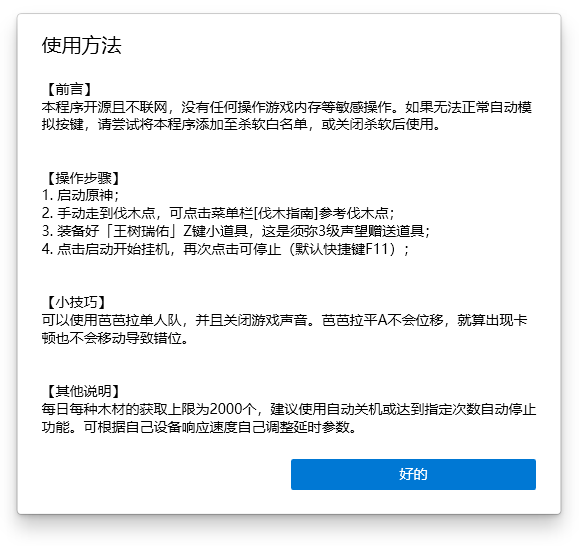

・[English](README.en.md) ・[中文](README.md) ・[日本語](README.jp.md)

# 原神伐木姬

> GenshinWoodmen

这是一项原神自动伐木的工具，利用须弥的便利道具「王树瑞佑」稳定获取木材，这是须弥3级声望赠送道具。

## 程序界面

## 使用方法

## 推荐伐木点

[点击这里](src/GenshinWoodmen/Resources/usage.jpg)

## 常见问题

1. 若安装包无法安装，请确保你的系统已安装应用商店，安装包依赖商店架构 (MSIX)。
2. 运行环境是net6.0-windows10.0.19041.0。
3. 如何按需选择程序包
   - 带Setup字眼的是安装包
   - 带full字眼的内置.NET运行环境

## 额外说明

- 针对B服的说明
  - [x] 自动检测系统安装原神是否为B服。前提是注册表有对应的安装记录，如果使用其他切服程序也能正确识别；
  - [x] 自动识别B服登录界面。B服登录框点击延时为登录延时的二分之一，因此每轮用时会延长这部分所需时长，但注意“不会”计入「用时预测」；

