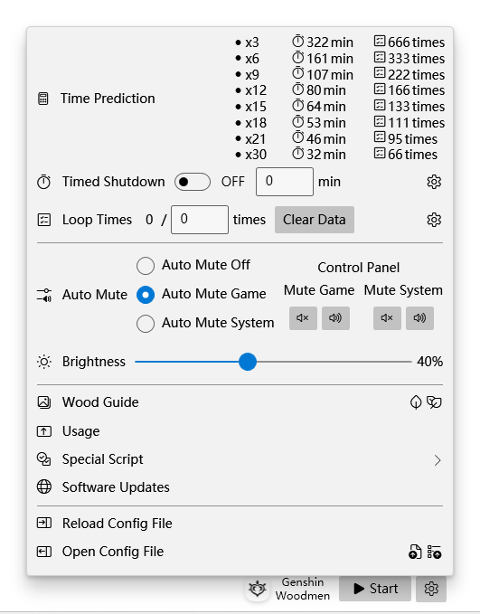

・[English](README.md) ・[中文](README.zh.md) ・[日本語](README.jp.md)

# Genshin Woodmen

This is an automatic tool to obtain woods in Genshin Impact using gadget named "The Boon of the Elder Tree", got from Sumeru City Reputation Level 3.

## Screen Shot

## Usage

[Announcement]&#10;This program is open source and running without network. If you can't auto simulate the key, please try to add this program to the anti-virus software white list, or turn off anti-virus software firstly.&#10;&#10;[Steps]&#10;1. Startup Genshin Impact;&#10;2. Change game resolution to 1440x900;&#10;3. Goto the wood point, recommended from "Wood Guide".&#10;4. Ready your Key Z gadget, named "The Boon of the Elder Tree", got from Sumeru City Reputation Level 3;&#10;5. Click "Start", and you can click again to "Stop" (default shortcut key is F11);&#10;&#10;[Techniques]&#10;To use Barbara Solo party and mute. Barbara's normal attack will not move character's location, even if there is stuck. Mute can stabilize the loading speed.&#10;&#10;[Others]&#10;The max number of each kind of wood is 2000 per day. It's recommended to use the function of auto shutdown or auto stop when the specified number of times is reached. You can adjust the delay parameters according to the response speed of your own equipment.

## Recommended Points

## FAQs

1. Only supported for Genshin Impact running in center of primary screen, and resolutions other than 1440x900 are not supported temporarily.
2. UAC requested for sim keyboard or mouse, when you install this program by setup, you should run as admin manually.
3. When the setup can't be installed. Please ensure that your system has installed the App Store. The setup depends on the store architecture (MSIX).
4. Runtime environment is net6.0-windows10.0.18362.0.

