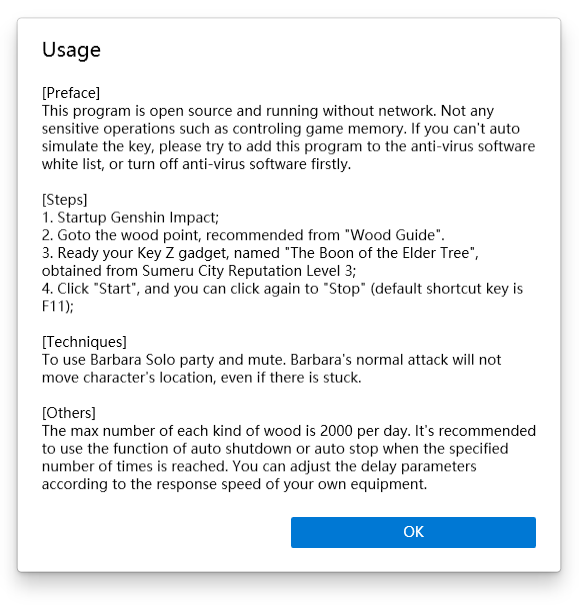
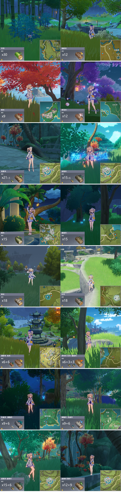

・[English](README.md) ・[中文](README.zh.md) ・[日本語](README.jp.md)

# Genshin Woodmen

This is an automatic tool to obtain woods in Genshin Impact using gadget named "The Boon of the Elder Tree", got from Sumeru City Reputation Level 3.

## Screen Shot

## Usage

## Recommended Points

## FAQs

1. Only supported for Genshin Impact running in center of primary screen, and resolutions other than 1440x900 are not supported temporarily.
2. UAC requested for sim keyboard or mouse, when you install this program by setup, you should run as admin manually.
3. When the setup can't be installed. Please ensure that your system has installed the App Store. The setup depends on the store architecture (MSIX).
4. Runtime environment is net6.0-windows10.0.18362.0.

