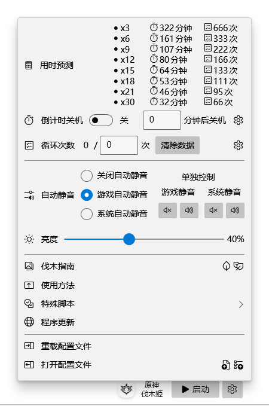

・[English](README.md) ・[中文](README.zh.md) ・[日本語](README.jp.md)

# 原神伐木姬

> GenshinWoodmen

这是一项原神自动伐木的工具，利用须弥的便利道具「王树瑞佑」稳定获取木材，这是须弥3级声望赠送道具。

## 程序界面

## 使用方法

【声明】&#10;本程序开源且不联网。如果无法正常自动模拟按键，请尝试将本程序添加至杀软白名单，或关闭杀软后使用。&#10;&#10;【操作步骤】&#10;1. 启动原神；&#10;2. 游戏设置里调整分辨率为1440x900；&#10;3. 手动走到伐木点，可点击菜单栏[伐木指南]参考伐木点；&#10;4. 装备好「王树瑞佑」Z键小道具，这是须弥3级声望赠送道具；&#10;5. 点击启动开始挂机，再次点击可停止（默认快捷键F11）；&#10;&#10;【小技巧】&#10;可以使用芭芭拉单人队，并且关闭游戏声音。芭芭拉平A不会位移，就算出现卡顿也不会移动导致错位，关闭声音稳定加载速度。&#10;&#10;【其他说明】&#10;每日每种木材的获取上限为2000个，建议使用自动关机或达到指定次数自动停止功能。可根据自己设备响应速度自己调整延时参数。

## 推荐伐木点

## 常见问题

1. 仅支持原神运行于主屏幕中心，暂不支持1440x900以外的分辨率。

3. 管理员UAC权限用于支撑模拟鼠键，如果你是采用安装包安装则需要手动右键以管理员权限运行。
4. 若安装包无法安装，请确保你的系统已安装应用商店，安装包依赖商店架构 (MSIX)。
5. 运行环境是net6.0-windows10.0.18362.0。